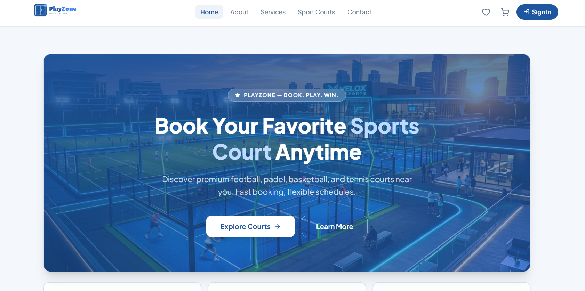

<p align="center">
  
</p>

<h1 align="center">PlayZone — Sport Court Booking</h1>

<p align="center">
  A modern web application for discovering and booking premium sports courts online.<br/>
  Football · Padel · Basketball · Tennis
</p>

<p align="center">
  
  
  
  
</p>

---

## Overview

PlayZone is a full-stack sports court booking platform built with Next.js 15 App Router. Users can browse courts by sport type, view court details, manage a cart and favourites list, and authenticate via Google or Facebook.



---

## Tech Stack

| Category         | Technology              |
| ---------------- | ----------------------- |
| Framework        | Next.js 15 (App Router) |
| Language         | TypeScript              |
| Styling          | Tailwind CSS v4         |
| Authentication   | NextAuth.js v4          |
| State Management | Zustand                 |
| Forms            | React Hook Form + Zod   |
| Icons            | Lucide React            |

---

## Features

- **Authentication** — Google & Facebook OAuth via NextAuth.js, protected routes with middleware, session-aware navbar
- **Home Page** — Featured courts with server-side fetching, sport category navigation, TanStack Query for state
- **Court Listing** — Server-side filtering & search by sport type, ISR revalidation, expandable descriptions
- **Court Detail** — Add to cart with quantity selector, dynamic routing, TanStack Query for detail state
- **Shopping Cart** — Full cart management (add, remove, adjust quantity), Zustand persistence, server-calculated totals
- **Favourites** — Wishlist with server actions, persistent state via Zustand
- **User Profile** — Session-based data fetching, editable profile, booking history

---

## Getting Started

### Prerequisites

- Node.js 18+
- A Google OAuth app ([Google Cloud Console](https://console.cloud.google.com))
- A Facebook OAuth app ([Facebook Developers](https://developers.facebook.com))

### Installation

```bash
git clone https://github.com/your-username/sport-court-booking.git
cd sport-court-booking
npm install
```

### Environment Variables

Create a `.env.local` file in the root:

```env
NEXTAUTH_URL=http://localhost:3000
NEXTAUTH_SECRET=your_nextauth_secret

GOOGLE_CLIENT_ID=your_google_client_id
GOOGLE_CLIENT_SECRET=your_google_client_secret

FACEBOOK_CLIENT_ID=your_facebook_client_id
FACEBOOK_CLIENT_SECRET=your_facebook_client_secret
```

### Run

```bash
npm run dev
```

Open [http://localhost:3000](http://localhost:3000).

---

## Project Structure

```
src/
├── app/
│   ├── about/
│   ├── api/auth/[...nextauth]/
│   ├── cart/
│   ├── contact/
│   ├── courts/
│   ├── favourites/
│   ├── login/
│   ├── profile/
│   └── services/
├── components/
│   ├── navigationLinks.tsx
│   ├── CourtCard.tsx
│   ├── Fillter.tsx
│   └── ...
└── middleware.ts
```

---
